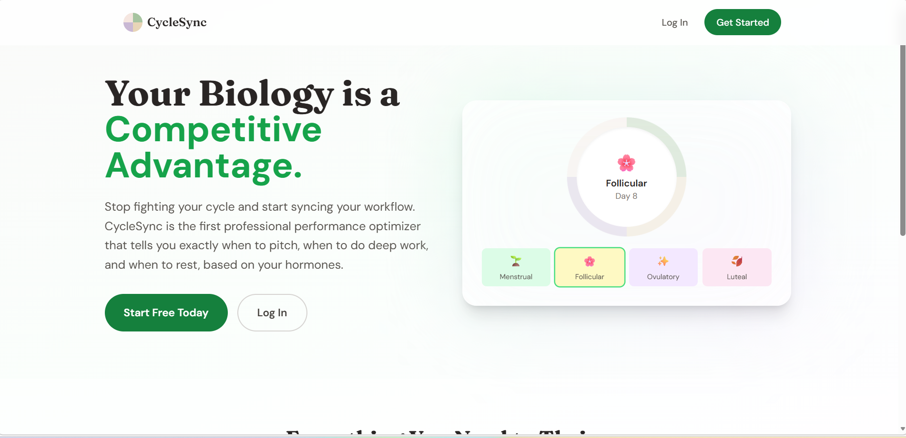
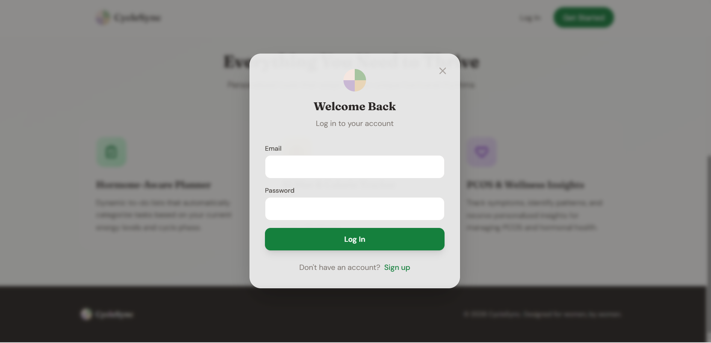
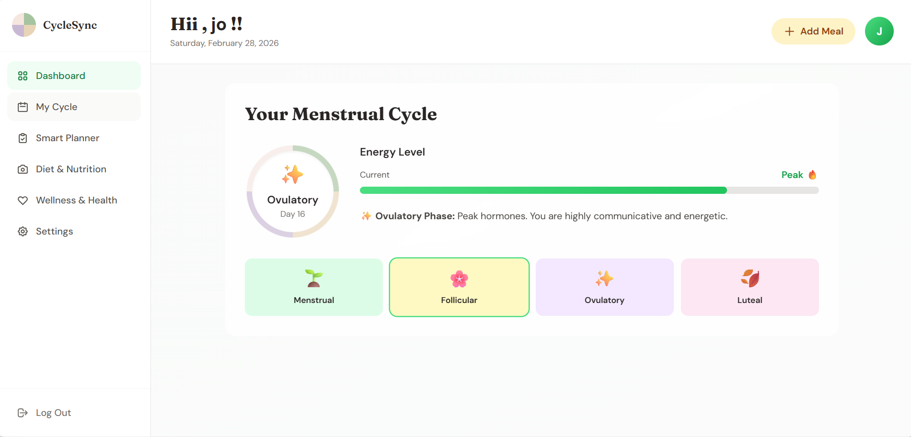
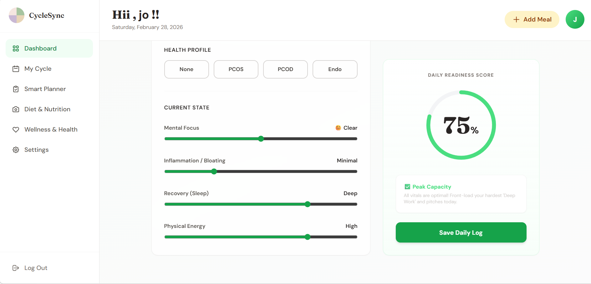

<p align="center">
  
</p>

# CycleSync 🎯

## Basic Details

### Team Name: RCB

### Team Members
- Member 1: Widad Sali - TKMCE Kollam
- Member 2: Mary Joicy Thomas - TKMCE Kollam

### Hosted Project Link
https://thriving-elf-52618d.netlify.app/

### Project Description
**CycleSync** is a wellness and performance optimizer designed to align a user's workflow, nutrition, and health tracking with their unique hormonal rhythms.

### The Problem statement
Many individuals struggle to maintain consistent productivity and wellness because traditional planners ignore the significant impact of hormonal fluctuations on energy, mood, and cognitive function.

### The Solution
We provide a "Bio-Hack" solution that maps tasks and nutrition to the four phases of the menstrual cycle, ensuring users work with their biology rather than against it.

---

## Technical Details

### Technologies/Components Used

**For Software:**
* **Languages**: JavaScript (Vanilla), HTML5, CSS3
* **Frameworks**: Express.js (Backend), Tailwind CSS (UI)
* **Libraries**: Mongoose (Database), Chart.js (Analytics), Axios (API calls), Dotenv
* **Tools**: VS Code, Git, GitHub, Render (Hosting), Netlify (Hosting)


## Features

List the key features of your project:
* **Hormone-Synced Planner**: Automatically categorizes tasks into "High Energy" or "Restful" based on the biological phase.
* **AI-Powered Nutrition Tracker**: Uses Google Gemini AI to analyze food photos and estimate nutritional content including calories, protein, carbs, and fats.
* **Bio-Performance Analytics**: Visualizes productivity heatmaps and readiness trends using Chart.js.
* **PCOS/Wellness Management**: Dedicated tracking for symptoms like inflammation, mental focus, and recovery.
---

## Implementation

### For Software:

#### Installation
```bash
# Clone the repository
git clone [https://github.com/widadsali/hormone-planner.git](https://github.com/widadsali/hormone-planner.git)

# Install backend dependencies
cd backend
npm install

# Start the backend server
node server.js


**Base URL:** `https://hormone-planner.onrender.com/api`

##### Endpoints

**POST /api/endpoint**
- **Description:** Sends an image to Gemini AI for nutritional breakdown.
- **Parameters:**
  - `param1` (string): [Description]
  - `param2` (integer): [Description]
- **Response:**
{
  "calories": 450,
  "protein": "20g",
  "carbs": "50g",
  "fat": "15g"
}
```

**POST /api/endpoint**
- **Description:** [Registers a new user with cycle details.]
- **Request Body:**
```json
{
  "status": "success",
  "message": "User registered successfully"
}
```
- **Response:**
```json
{
  "status": "success",
  "message": "Operation completed"
}
```
<p align="center">
  
</p>
*dashboard*

<p align="center">
  
</p>
*Current Phase*

<p align="center">
  
</p>
*Health Status*

#### Diagrams

**System Architecture:**

![Architecture Diagram]
*The application follows a Client-Server architecture. The Vanilla JS frontend communicates with a Node.js/Express backend hosted on Render, which manages a MongoDB Atlas database and integrates the Google Gemini AI Pro Vision model*

**Application Workflow:**

![Workflow]
*User Logs In -> Input Cycle Data -> App Calculates Phase -> Planner Adjusts Recommendations -> User Logs Meal -> Gemini AI Processes Photo -> Dashboard Updates.*

---


## Project Demo

### Video
(https://drive.google.com/file/d/1SZ-BwuM93oF1ni47GajjmojJu3Pc8EOI/view?usp=sharing)


---

## AI Tools Used (Optional - For Transparency Bonus)

If you used AI tools during development, document them here for transparency:

**Tool Used:** [e.g., GitHub , Canva , ChatGPT, Gemini]


## Team Contributions

- Widad Sali: Backend development, Gemini AI integration, and Database design.
- Mary Joicy Thomas: Frontend UI development, Hormone-logic implementation, and Documentation.

Made with ❤️ at TinkerHub